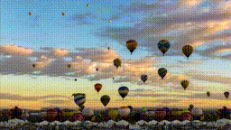
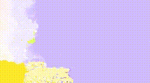
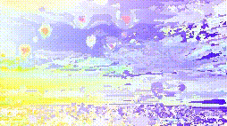

# NNF Diversity Metric (NNFDIV)
Code for computing the NNF Diversity metric (or "NNFDIV"), as described in [SinFusion](https://yaniv.nikankin.com/sinfusion/) paper in section 7.2. 

### What's "NNF Diversity Metric"?

<table>
<tr style="text-align: center"><td>Original</td><td>VGPNN</td><td>NNF</td></tr>
<tr>
<td></td>
<td></td>
<td></td>
</tr>
<tr style="text-align: center"><td>Original</td><td>SinFusion</td><td>NNF</td></tr>
<tr>
<td></td>
<td></td>
<td></td>
</tr>
</table>


NNFDIV quantifies the diversity of generated samples from models 
trained on a single video (could also apply to single image) like 
[HPVAEGAN](https://shirgur.github.io/hp-vae-gan/), 
[SinGAN-GIF](https://rajat95.github.io/singan-gif/), 
[VGPNN](https://nivha.github.io/vgpnn/)
and [SinFusion](https://yaniv.nikankin.com/sinfusion/). 

The outputs of such models tend to be simple "shuffling" 
of the original video on which they were trained (see for example VGPNN sample above). Previous metrics like SIFID (from [SinGAN](https://tamarott.github.io/SinGAN.htm)) or SVFID (from HPVAEGAN) 
compute Frechet distance in patch-features space (Inception or C3D respectively), 
therefore measuring quality/similarity of the generated patches to the original image/video.
Therefore, a very "stupid" generator which simply outputs translations of the original image/video
would have very good score on SIFID/SVFID.

NNFDIV first computes the Nearest-Neighbour Field (NNF) between 
a generated sample and its original image/video. Note that simple translations will 
have constant NNF, and simple "shuffling's" will have "simpler" NNFs, while more diverse
samples will have more "complex" NNFs. So simple/diverse geneartions will have simple/complex
NNfs, and the notion of "complex" vector field can be captured by the
[minimal description length](https://en.wikipedia.org/wiki/Minimum_description_length) of the NNF, 
which is upper-bounded by any compression algorithm.

In short, NNFDIV is the compression ratio of the NNF between the generated and original videos.


#### Limitations:

The current NNFDIV only consider the displacements between each generated patch to its nearest-neighbour.
It does not take into account the quality of the generated patches to the original image/video 
(like SIFID/SVFID). This can be accounted for by also considering the "distance" of each patch 
to its nearest-neighbour (which is easily accessible in our code). However, it is not clear how to
weigh between the patch displacement and distance, so at the moment we left it for future work.

<hr>

### Computing NNFDIV

For two videos vid1 amd vid2 of shape NCTHW (N=1, C=3):

```python
from nnf_evaluation import get_nnfdiv
nnf, nnfdiv = get_nnfdiv(vid1, vid2)
```

This will return the NNF from vid1 to vid2, and the NNF diversity metric.

### Visualizing NNFs

Please check out the notebook ```nnfdiv_viz.ipynb``` for visualizing NNFs (as shown in 
[SinFusion project page](https://yaniv.nikankin.com/sinfusion/static/experiments.html))

<hr>

### Citation
If you find our project useful for your work please cite:

```
@misc{haim2023nnfdiv,
  author={Haim, Niv and Feinstein, Ben and Nikankin, Yaniv and Irani, Michal},
  title={NNFDIV: A Nearest-Neighbour-Field Approach for Quantifying Diversity of Generated Samples},
  year = {2023},
  publisher = {GitHub},
  journal = {GitHub repository},
  howpublished = {\url{https://github.com/nivha/nnf_diversity}},
}
```
